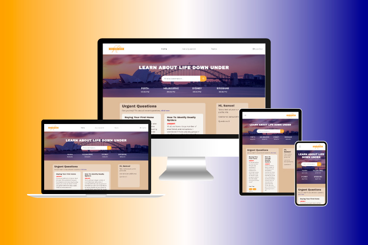

<h1 align="center">Chat Down Under - A Discussion Forum for all things Australia Migration</h1>

[View the live project here.](!!!INSERT HEROKU LINK HERE""")

This is a dicussion forum using a relational database that will allow users to proactively discuss topics regarding migrating to Australia. 

Utilising Bootstrap row/column tool the site will present responsively and in a well structured, readable, easy to navigate way so as to allow maximum UX. Using python the site will be structured in such a way that users will be able to log in, submit their question and review answers that others may have given on those questions. User authentication will allow users to view, edit and delete their questions, as well as view, edit and delete their responses to others questions. 

**Key Features**

1. User registration, login and logout functionality
2. Submit questions for discussion
3. Tag questions with topics for easy navigation
4. Search bar that will find results if your search matches title, body or tags of a question
5. Add topics if you cannot find one relevant to your question
6. Reply to questions for a full discussion experience

The app will be rigorously User Tested and will be deployed to Heroku for online access. 

<h2 align="center"></h2>

## Future Developments

1. Replying to replies - I would like to incorporate the logic for a user viewing their own question, to reply to answers given by the community. This will enhance user experience - at present they can add a comment but this may cause comment threads to get longer than they may need and out of control. Whereas if a user can reply directly to an answer it will keep it more strucutured. 

1. Add new Topic within Question (user feedback) - I tried several different routes but this was proving a little beyond scope for this project. I would like to incorporate the option so as when a user selects their topic, if a relevant topic is not present they can type their own, submit it and have it either dynamically update the list, so they can select their new topic, or submit the new topic as part of the form and have the backend handle the logic - I did trial this with a new topic as a separate option, but it caused the topic selector to become buggy and not perform as it should. Instead, I tried utilising AJAX to dynamically update the list, but again, this caused issue with Select2 and also continued to refresh the page making for a worse user experience. 

1. Search bar functionality - I would like to make the search more flexible, so if it finds "part" of the search term it will still return results as opposed to finding exact matches only

1. Image upload - allow users to upload images to their discussions - questions, replies etc. 

1. Profile picture - allow users to personalise their user profile further by adding a profile picture or avatar. 

1. Dedicated user profile area - perhaps incorporate a user profile page so users can see their questions, see if people have replied and also view their stats (how long they have been a member, how many questions they have asked, how many questions they have contributed to with answers etc.)

1. No Longer Urgent - have a button in view for the author of a question to click that will set is_urgent to false. This will allow for seamless changes if the question is answered or expired. 

1. Clickable topics - make topics on topic page and topic tags on questions clickable - taking users to a "results" page of relevant questions

1. Edit & Delete replies - give users the option to edit or delete their replies to questions

1. Reply counter and up-vote system - implement some sort of "like" or "upvote" system to rank replies and display highest ranking (most helpful) first. Also have a reply counter so users can see the size of a thread. 


## Testing

All testing documentation including user feedback can be found in TESTING.md

## User Experience (UX)

- ### User stories

- #### First Time Visitor Goals

  1. As a First Time Visitor, I want to easily understand the main purpose of the web app.
  2. As a First Time Visitor, I want to be able to easily navigate the app and register my account.
  3. As a First Time Visitor, I want to be able to easily understand how to submit a question or reply to others questions

- #### Returning Visitor Goals

  1. As a Returning Visitor, I want to see if there are new questions being asked.
  2. As a Returning Visitor, I want to check my questions to see if they have been answered.

- #### Frequent User Goals

  1. As a Frequent User, I want to be able to engage in discussions around specific topics.
  2. As a Frequent User, I want to be able to update my questions and answers or delete if necessary.

- ### Design

- #### Colour Scheme

  - The main colours used are #fba018 (Primary Orange), #00008b (Primary blue and dark text colour), off-white #fafafa (250,250,250) (Used in a variety of ways adjusting transparency to adapt to different areas).
  - All colours tested on WebAIM Contrast Checker - all passed, though made adjustments such as not having blue on orange too much. Whilst it passes contrasting checks with flying colours, it isn't that pleasant to look at. 
  - Other colours were used for interaction feedback, such as Reds for delete buttons, darker oranges for hovers on buttons and lighter blues for the same purpose. 

- #### Typography

  - The Archivo Black (Google Font) is the main font used throughout fopr headings and emphasis text with Sans Serif as the fallback font in case for any reason the font isn't being imported into the site correctly. Archivo Black is easy to read, displays nicely and adds emphasis where necessary. 
  - Additional typography will all be sans-serif system fonts to allow for easy readability due to the nature of the site. 

- #### Imagery

  - **Masthead** - Image by Wirestock on [Freepik](https://www.freepik.com/free-photo/beautiful-shot-sydney-harbor-bridge-with-light-pink-blue-sky_10399362.htm)

  - Logo, mockups - all created by myself using Illustrator

- #### Interaction Feedback

  - Accent colours are used upon interaction such as hover and click to provide feedback to the user that they are interacting with an element, and that the element serves a purpose.
  - Flash messages used to notfiy users of errors or successes depending on outcome. Auto timeout included to avoid having to close every time. 

## Wireframes

- All basic wireframes can be found here - [View](/downunder/static/readme/wireframe/ChatDownUnder.pdf)

## Database Models 

- PDF example of my database models used can be found [here](/downunder/static/readme/database/CDU-DB-Diagram.pdf)

### Deviations

It should be noted that whilst the wireframes were implemented as part of the skeleton phase of UX planning at the outset, applying that 5 S's throughout led to some important amendments according to project scope and useability.

## Features

- Responsive on all device sizes

- PSQL Relational Database

- Flask/SQLAlchemy used to implement CRUD functionality for users

- User ID's allow for user specific CRUD

- Modals used for defensive programming when it comes to item deletion

- Interaction feedback used throughout.

- Reply functionality enhances discussion experience


## Technologies Used

### Languages Used

- [HTML5](https://en.wikipedia.org/wiki/HTML5)
- [CSS3](https://en.wikipedia.org/wiki/Cascading_Style_Sheets)
- [Javascript](https://en.wikipedia.org/wiki/JavaScript)
- [Python](https://docs.python.org/3/)

### Frameworks, Libraries & Programs Used

1. [Bootstrap 4.4.1:](https://getbootstrap.com/docs/4.4/getting-started/introduction/)
   - Bootstrap was used to assist with the responsiveness and styling of the website.
2. [Jest:](https://jestjs.io/)
   - Jest was used to test the Javascript used
3. [SQLAlchemy:](https://docs.sqlalchemy.org/en/20/)
   - SQLAlchemy was used to communicate between the database and the frontend
4. [Google Fonts:](https://fonts.google.com/)
   - Google fonts were used to import the 'Archivo Black' font into the "Head" section of each html file which is used on all titles and emphasises throughout the project.
5. [Font Awesome:](https://fontawesome.com/)
   - Font Awesome was used throughout the website to add icons for aesthetic and UX purposes.
6. [jQuery:](https://jquery.com/)
   - jQuery came with Bootstrap to make the navbar responsive but was also used for Select2 
7. [Select2:](https://select2.org/)
   - Select2 was used for styling the dropdown and allowing for multiple selections without having to hold down CMD/CTRL or Shift
8. [FLASK:](https://flask.palletsprojects.com/)
   - Flask Frameworking was used to structure the site including the use of Jinja2 templating. Allowed for the smooth display of data from the backend. 
7. [Git](https://git-scm.com/)
   - Git was used for version control by utilizing the Gitpod terminal to commit to Git and Push to GitHub.
8. [GitHub:](https://github.com/)
   - GitHub is used to store the projects code after being pushed from Git.
9. [Illustrator:](https://www.adobe.com/uk/products/illustrator.html)
   - Illustrator was used to create the logo
10. [Figma:](https://www.figma.com/)
      - Figma was used for all wireframing and flow illustration
11. [Youtube - TechWithTim:](https://www.youtube.com/@TechWithTim)
      - TechWithTim was a great help in understanding some of the more complex elements of Python programming and also in implementing my Login/Signup process
12. [StackOverflow:](https://stackoverflow.com/)
      - Used for code snippets and code validation, as well as tutorials and some vital help
13. [DBDiagram:](dbdiagram.io)
      - Used to generate database model diagrams

## Testing

A separate tests document has been added. This includes details on user testing. There is also a test_app.py for testing the python when it came to adding, editing and deleting elements to avoid messing with the live preview. 

JEST testing was carried out to an extent with the limited Javascript that was used. Issues were encountered with tests timing out for the World clock test. Also did not need to test the Select2 implementation other than for functionality and so this was executed through user testing. 

Further testing details such as Element and section testing can be found in the TESTING.md. 

**PEP8 COMPLIANCE**
 - Guideline added at 79th column to ensure I did not exceed the recommended line length. Ensured all functions worked as they should even after reformatting where necessary.
 - Indentation used correctly throughout - consistently used tab method as opposed to space. 

**HTML & CSS**
- Little to no HTML CSS testing was required due to the simplicity of the web pages - listed main pages below:

The W3C Markup Validator and W3C CSS Validator Services were used to validate every page of the project to ensure there were no syntax errors in the project. A few examples included below:

- [W3C Markup Validator](https://validator.w3.org/nu/#textarea) :

| index.html                                      | level-1.html                                        | leaderboard.html                                            |
| ----------------------------------------------- | --------------------------------------------------- | ----------------------------------------------------------- |
|  |  |  |

- [W3C CSS Validator](https://jigsaw.w3.org/css-validator/#validate_by_input) - - all clear
- 

### Testing User Stories from User Experience (UX) Section

#### First Time Visitor Goals


  1. As a First Time Visitor, I want to easily understand the main purpose of the web app.

     1. Upon entering the site, users are automatically greeted with a clean and easily readable navigation bar which clearly showcases the main functions of the site including "Ask a Question" and "Topics"
     2. The addition of an About page enables users to explore a guide on the setup and purpose of the site.
     3. Clear prompts including prompts to create account or login

  2. As a First Time Visitor, I want to be able to easily navigate the app and register my account.

     1. If you are not logged in you will immediately be able to see a "Sign Up" button
     2. Additionally there is a prompt on the initial question block suggesting you register to contribute with a link taking you to sign up page
     3. Flash messages notfiying of elements off limits unless you are logged in

  3. As a First Time Visitor, I want to be able to easily understand how to submit a question or reply to others questions

     1. The about page serves its purpose well here advising on how to engage in discussion
     2. Buttons and links used to direct users to login to be able to contribute, and once logged in bright colour buttons promting a reply. 
     3. Navigation to "Ask Question" and buttons for "reply" help users through the discussion flow

#### Returning Visitor Goals

  1. As a Returning Visitor, I want to see if there are new questions being asked.

     1. The homepage showcases all recent questions as well as the latest urgent questions to enable users to immediately engage in the latest conversations

  2. As a Returning Visitor, I want to check my questions to see if they have been answered.

     1. The "View My Questions" button on the homepage under user info allows direct navigation to user specific questions.

#### Frequent User Goals

  1. As a Frequent User, I want to be able to engage in discussions around specific topics.

     1. The ability to search different topics and discussions allows users to specifically target discussions relevant to their current needs or something they may have an answer to

  2. As a Frequent User, I want to be able to update my questions and answers or delete if necessary.

     1. User authentication allows users to edit and delete their own questions. 

### Further Testing

- The Website was tested on Google Chrome, Microsoft Edge and Safari browsers. It was also tested in Internet Explorer Mode on Microsoft Edge.
- The website was viewed on a variety of devices such as HP Windows Desktop, Macbook, iMac, iPhone12, iPhone 14 Pro, iPhone 8, iPad Air, iPad Pro 12.9", Pixel 5, Samsung Galaxy S20 Ultra, Surface Pro 7 and Nest Hub. Responsiveness was near flawless thanks to implementing the Bootstrap column system.
- A large amount of testing was done to ensure that all user interactions throughout the site responded as they should
- Friends and family members were asked to review the site and documentation to point out any bugs and/or user experience issues.

#### Google Lighthouse

- Google Lighthouse was used to ensure compatability, best practice and accessibility as well as load times.

| index.html                                        | level-1.html                                          | leaderboard.html                                              |
| ------------------------------------------------- | ----------------------------------------------------- | ------------------------------------------------------------- |
|  |  |  |

##### Load Speed

- Results were fairly good for all pages with 73% + all round. Slowest was level 1 for the obvious reason that it has the highest JS content.

##### Accessibility

- Accessibility sits at 100 for all pages bar the leaderboard - not a big issue but complaints of headings not being sequencial but it is not relevant for this page.

##### Best Practices

- Best Practices sits at 92 out of 100 - there was one error, JS error logged to console. I cannot seem to get rid of these errors.

## Deployment

### GitHub Pages

The project was deployed to GitHub Pages using the following steps...

1. Log in to GitHub and locate the [GitHub Repository](https://github.com/sdthomas91/ng-spmu-milestone)
2. At the top of the Repository (not top of page), locate the "Settings" Button on the menu.
   - Alternatively Click [Here](https://raw.githubusercontent.com/) for a GIF demonstrating the process starting from Step 2.
3. Scroll down the Settings page until you locate the "GitHub Pages" Section.
4. Under "Source", click the dropdown called "None" and select "Master Branch".
5. The page will automatically refresh.
6. Scroll back down through the page to locate the now published site [link](https://github.com/sdthomas91/ng-spmu-milestone) in the "GitHub Pages" section.

### Forking the GitHub Repository

By forking the GitHub Repository we make a copy of the original repository on our GitHub account to view and/or make changes without affecting the original repository by using the following steps...

1. Log in to GitHub and locate the [GitHub Repository](https://github.com/sdthomas91/ng-spmu-milestone)
2. At the top of the Repository (not top of page) just above the "Settings" Button on the menu, locate the "Fork" Button.
3. You should now have a copy of the original repository in your GitHub account.

### Making a Local Clone

1. Log in to GitHub and locate the [GitHub Repository](https://github.com/sdthomas91/ng-spmu-milestone)
2. Under the repository name, click "Clone or download".
3. To clone the repository using HTTPS, under "Clone with HTTPS", copy the link.
4. Open Git Bash
5. Change the current working directory to the location where you want the cloned directory to be made.
6. Type `git clone`, and then paste the URL you copied in Step 3.

```
git clone https://github.com/sdthomas91/ng-spmu-milestone
```

7. Press Enter. Your local clone will be created.

```
$ git clone https://github.com/sdthomas91/ng-spmu-milestone
> Cloning into `CI-Clone`...
> remote: Counting objects: 10, done.
> remote: Compressing objects: 100% (8/8), done.
> remove: Total 10 (delta 1), reused 10 (delta 1)
> Unpacking objects: 100% (10/10), done.
```

Click [Here](https://help.github.com/en/github/creating-cloning-and-archiving-repositories/cloning-a-repository#cloning-a-repository-to-github-desktop) to retrieve pictures for some of the buttons and more detailed explanations of the above process.

## Credits

### Code

- [Bootstrap4](https://getbootstrap.com/docs/4.4/getting-started/introduction/): Bootstrap Library used throughout the project mainly to make site responsive using the Bootstrap Grid System.

- [W3CSchools](https://www.w3schools.com/) W3C schools used for CSS/HTML confirmation

- [MDN Web Docs](https://developer.mozilla.org/) : For Pattern Validation code. Code was modified to better fit my needs and to match an Irish phone number layout to ensure correct validation. Tutorial Found [Here](https://developer.mozilla.org/en-US/docs/Web/HTML/Element/input/tel#Pattern_validation)

- [StackOverflow](https://stackoverflow.com/) : For coding validation and tips on refining code. Also used for code snippets customised with my own css or JS.

- [CodePen](https://codepen.io/samueldthomas91/pen/oNJVxYx) : Codepen was used to explore examples of the game style I wanted to implement. I also used codepen to build my JS logic as it was easier to view and edit. My final codepen before transferring it back to codeanywhere can be found [HERE](https://codepen.io/samueldthomas91/pen/OJrKNgP)

### Content

- Colour and content completely designed by myself

- Psychological properties of colours text in the README.md was found [here](http://www.colour-affects.co.uk/psychological-properties-of-colours)

- Colour combinations, hex code -> rgb conversion and palettes were found [here] (<https://www.colorhexa.com/>)

### Media

- Masthead backgroud image - [Freepik](https://www.freepik.com/free-photo/beautiful-shot-sydney-harbor-bridge-with-light-pink-blue-sky_10399362.htm#query=sydney&position=0&from_view=search&track=sph&uuid=ce4ecea8-9b88-4c4b-8630-f9f657464361)

### Audio

- Error Sound : Sound effect from [PixaBay](https://pixabay.com/sound-effects/?utm_source=link-attribution&utm_medium=referral&utm_campaign=music&utm_content=7184)
- Correct Sound : Sound effect from [PixaBay](https://pixabay.com/?utm_source=link-attribution&utm_medium=referral&utm_campaign=music&utm_content=6033)
- Winning Sound : [UppBeat](https://uppbeat.io/browse/sfx/celebrate)
- Background Music : license included in assets/copyright

#### README Mockup

- .ai file used for Mockup at the top of README file : Image by [Freepik](https://www.freepik.com/free-vector/flat-design-responsive-website-design_28747716.htm#query=multi%20device%20mockup&position=2&from_view=keyword&track=ais)

### Acknowledgements

- Tutor support at Code Institute for their support.

- Pasquale Fasulo for continuous helpful input and feedback

- My mentor, Gurjot for continued input and direction

- © 2014 Nate Wiley CodePen for the initial inspiration

- Friends and family for valuable insights and feedback