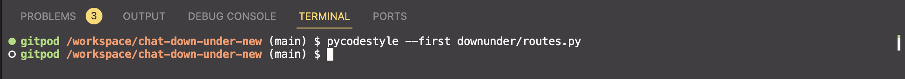

<h1 align="center">Chat Down Under - Testing & Resolution</h1>

[View the live project here.]()

The purpose of this document is to identify key testing stages and instances where decisions were made to change or keep certain features.

- [Code Validation](#code-validation)
    * [W3C HTML Validator](#w3c-html-validator) 
    * [W3C CSS Validator](#w3c-css-validator)
    * [JSHINT Javascript Code Quality Tool](#jshint-javascript-code-quality-tool)
    * [Python Validation using Gitpod](python-validation-using-gitpod)
      + [models.py](#modelspy)
      + [routes.py](#routespy)
      + [__init__.py](#initpy)
      + [run.py](#runpy)
      + [test_app.py](#test_apppy)
- [A11y Color Contrast Accessibility Checker](#a11y-color-contrast-accessibility-checker)
- [Wave Webaim Accessibility Checker](#wave-webaim-accessibility-checker)
- [Lighthouse](#lighthouse)
- [Responsiveness](#responsiveness)
- [Browser Compatibility](#browser-compatibility)
- [User Experience](#user-experience-ux)
  * [Testing User Stories](#testing-user-stories)
      + [First Time User](#first-time-user)
      + [Returning User](#returning-user)
      + [Frequent User](#frequent-user)
      + [Site Owner](#site-owner)
- [Manual Testing](#manual-testing)
- [Automated Testing](#automated-testing)
  * [Javascript Testing](#javascript-tests)
  * [Python Testing](#python-tests)
- [User Feedback](#peer-review)
  * [Feedback Implementations](#user-feedback-implementations)
- [Bugs](#bugs)
    - [Resolved](#resolved)
    - [Unresolved](#unresolved)

# Code Validation

## W3C HTML Validator

- Initial test displayed some HTML errors but corrected all and passed
  | HTML Errors | HTML Passed
  | -------------------- | -------------- |
  |  |  |

## W3C CSS Validator

- All CSS clear - validation passed
  | Validated CSS |
  | -------------------- |
  |  |

## JSHINT Javascript Code Quality Tool

- Largely a pass on JSHint, only issue being the ES6 compatability but this is a warning and not an error
  | JSHint Pass |
  | -------------------- |
  |  |

##  Python Validation with pycodestyle

- Used python command pycodestyle to validate all code within Gitpod
<h2 align="center"></h2>

### models.py

  | Errors | Resolved |
  | ------ | -------- |
  |  |  |

### routes.py

  <h2 align="center"></h2>

### __init__.py

  <h2 align="center"></h2>

### run.py

 <h2 align="center"></h2>

### test_app.py

 <h2 align="center"></h2>


# Colour Contrast A11Y

- Used A11Y Colour checker to ensure site contrast was user friendly. Tested index page, but same colour scheme is used throughout.
- Encountered some errors - one was left unrersolved as it was not accurate - it accounted for the title on the body colour but it sits ontop of a dark blue overlay on the masthead image. 

| Errors | Resolved |
  | ------ | -------- |
  |  |  |


# Wave Webaim Accessibility Checker

Used Wave Accessibility Checker to check the index page. Errors were found, but were irrelevant. They pertain to a hidden label on the search bar, empty button as an icon was used for search bar and empty links as I used icons for social links. 

 <h2 align="center"></h2>

# Google Lighthouse

Lighthouse was used to check the following metrics: 
  - Performance
  - Accessibility
  - Best Practices
  - SEO

- Chat Down Under encountered a surprisingly large number of issues when run on desktop. These largely centered around missing aria-labels for elements that had no text. 
- There were some contrasting issues which came as a surprise having already audited with WebAim - it meant changing some of the main colours around but as you can see, all issues were resolved and it now performs exceptionally on Desktop. 

| Errors | Resolved |
| ------ | -------- |
|  |  |

- Mobile passed well in all areas except performance. This is largely to do with the high demand of the masthead load time but otherwise a good browsing experience. 

 <h2 align="center"></h2>


# Browser Compatibility

The site was tested in Google Chrome, Microsoft Edge and Mozilla Firefox on desktop.

The site was tested in Google Chrome and Safari on mobile and tablet.

During browser testing it was found that flash messages were falling behind text and not displaying well for accessibility :

| Errors | Resolved |
| ------ | -------- |
|  |  |

There was also the issue that the desktop user profile was still displaying and causing UX issues : 

<h2 align="center"></h2>

Easily resolved using bootstrap classes to hide depending on viewport

# Responsiveness

Responsivity tests were carried out using Google Chrome DevTools. Device screen sizes covered include:
- iPhone 6/7/8
- iPhone XR
- iPhone 12 Pro
- Pixel 5
- Samsung Galaxy S8+
- Samsung Galaxy S20 Ultra
- iPad Pro
- iPad Mini
- Surface Pro 7
- Surface Duo
- Galaxy Fold
- Samsung Galaxy A51/71
- Nest Hub
- Macbook Pro

I also personally tested the website on iPhone 14 Pro, iPad Pro 2nd Generation, Macbook Pro and HP Pavilion Desktop.


# User Experience (UX)

## Testing User stories

### First Time User

  1. As a First Time Visitor, I want to easily understand the main purpose of the web app.

     1. Upon entering the site, users are automatically greeted with a clean and easily readable navigation bar which clearly showcases the main functions of the site including "Ask a Question" and "Topics"
     2. The addition of an About page enables users to explore a guide on the setup and purpose of the site.
     3. Clear prompts including prompts to create account or login

  2. As a First Time Visitor, I want to be able to easily navigate the app and register my account.

     1. If you are not logged in you will immediately be able to see a "Sign Up" button
     2. Additionally there is a prompt on the initial question block suggesting you register to contribute with a link taking you to sign up page
     3. Flash messages notfiying of elements off limits unless you are logged in

  3. As a First Time Visitor, I want to be able to easily understand how to submit a question or reply to others questions

     1. The about page serves its purpose well here advising on how to engage in discussion
     2. Buttons and links used to direct users to login to be able to contribute, and once logged in bright colour buttons promting a reply. 
     3. Navigation to "Ask Question" and buttons for "reply" help users through the discussion flow

### Returning User

  1. As a Returning Visitor, I want to see if there are new questions being asked.

     1. The homepage showcases all recent questions as well as the latest urgent questions to enable users to immediately engage in the latest conversations

  2. As a Returning Visitor, I want to check my questions to see if they have been answered.

     1. The "View My Questions" button on the homepage under user info allows direct navigation to user specific questions.

### Frequent User

  1. As a Frequent User, I want to be able to engage in discussions around specific topics.

     1. The ability to search different topics and discussions allows users to specifically target discussions relevant to their current needs or something they may have an answer to

  2. As a Frequent User, I want to be able to update my questions and answers or delete if necessary.

     1. User authentication allows users to edit and delete their own questions. 

### Site Owner

  1. As site owner I want users to be able to submit, edit. and delete their own questions
    1. Permissions have been installed that prevent users from updating or deleting anyones questions but their own
  2. As site owner I want topic deletion to be limited to admins only
    1. Permissions are in place that allow only those tagged with is_admin to delete topics within the view topics page
  3. As site owner I want the website to be responsive and display well on all devices for optimal UX. 
    1. The website has been designed and developed to look good on all devices and screen sizes whilst maintaining maximum UX, UI and functionality. 
  4. As site owner I want certain aspects to only be achievable by users that have an account and are logged in
    1. Permissions are in place that prevent non authenticated users from creating, editing, replying to or deleting questions. 


# Manual Testing

## Nav Bar

| Logged In | Logged Out |
| ------ | -------- |
|  |  |

* The main navigation buttons have been tested and proven to work
* User permissions have been tested and proven to display differently for logged in and logged out users

## Footer

<h2 align="center"></h2>

* Logo link tested and proven to work
* Social links tested and proven to work

## Flash Messaging

| Error | Success |
| ------ | -------- |
|  |  |

* Flash messages have been tested and proven to work including fade in and auto fade out
* Error and success flash messages display differently for user feedback

## User Permissions

* User permissions tested and proven to work including authenticated vs non-authenticated and author vs non-author

## Home Page Display

* Buttons have been tested and proven to work
* Links have been tested and proven to work
* User permissions have been tested and proven to work; certain buttons will only display for logged in users and different buttons will display if you are the author of the question 

| Logged In | Logged Out | Logged In Author |
| ------ | -------- | -------- |
|  |  |  |

## Sign up and Login

| Sign Up | Login |
| ------ | -------- |
|  |  |

* All buttons, forms and requirements tested and proven to work 
* Attempting to login with false details does not work
* Attempting to register with non-matching passwords does not work 
* attempting to signup with non-unique username or email does not work

## Ask Question

<h2 align="center"></h2>

* All forms and buttons tested and proven to work
* Select2 dropdown multiple selection tested and proven to work
* 3 topic limit and min 1 topic selected tested and works
* Tried to submit without accepting terms and received form error 

## Edit Question

<h2 align="center"></h2>

* Tried accessing as separate user but permissions would not allow - flash message appears and redirects back to question page
* edit form tested and proven to work including removing "is_urgent"

## Delete Question

<h2 align="center"></h2>

* Defensive programming used via modal to allow custom to confrim deletion before proceeding 

## My Questions

<h2 align="center"></h2>

* question interaction tested and proven to work
* buttons tested and proven to work
* only displays questions from the logged in author

## Search Results

<h2 align="center"></h2>

* search function tested and proven to work 
* questions including the search term in title, body or topics proven to show on search
* fallback for no matching questions proven to work

## Add Topic

<h2 align="center"></h2>

* add topic form proven to work 

## View Topics

<h2 align="center"></h2>

* Only admins can delete topics, proven to work

## About Page

<h2 align="center"></h2>

* all buttons tested and proven to work 
* responsiveness tested and proven to work

# Automated Testing

## Javascript Tests 

- I have included a JEST document that documents the javascript testing. 
- Some functions caused other function tests to crash so commented out and tested separately
- All successful though did not need to JEST test Select2 JS

## Python Tests

- I included a test_app.py file. This was used when I encountered bugs or issues
- Initial setup of sign-up form threw back a number of errors. Using online resources and a test_app I managed to iron out the issues and now works smoothly
- My initial run at submitting a question proved messy so I used test_app to ensure it was all working to avoid bugs and cluttering the database


# USER FEEDBACK 

## User Feedback Implementations

1. After some user feedback it was decided that a more generalised searchability would better enhance the UX of the site

    - Used advanced routing and the ilike() python method to implement a more robust and flexible search experience for users allowing for the system to compare their search term to title, body and topics instead of just topics.   

1. One piece of user feedback suggested implementing some sort of world clock so people could see the time in different parts of australia compared to UK time

    - Utilised Javascript to display world clocks according to different parts of Australia (major cities)

1. Some users fedback that they didn't fully understand the purpose or layout of the site upon first visit.

    - Added an about us page to avoid confusion and aid user experience. Also added prompts and clear titles so each section was fairly transparent on it's purpose and display

1. Make topic tags clickable

    - Some users fedback that they would like the topic tags (on questions and on topic page) to be clickable, the click would then take them to posts related to these topics. It is a functionality I would like to implement at a later date, but it is not within the scope or timeframe of this project

1. Question display on home page

    - a peer advised that the bootstrap column method sets the page up nicely but when questions are of varying length it can cause an odd pattern of stacking and makes the homepage look messy. Upon review I agree and whilst implemented on urgent questions future developments will see a better question structure and display - though to change the whole structure at this stage would prove time consuming. 


## Bugs (All bugs now Resolved)

- Wanted to include a record of found and resolved bugs

1. One-to-many or many-to-many : Issues arose with my existing question model obtaining a topic_id. I had it set to a one-to-many relationship. Within user testing and error resolution I resolved that a many-to-many relationship makes more sense. This was users can select up to 3 topics relevant to their question, enhancing the filtering capabilities and reducing user difficulty in defining a single topic. Found [this](https://support.microsoft.com/en-gb/office/video-create-many-to-many-relationships-e65bcc53-8e1c-444a-b4fb-1c0b8c1f5653#:~:text=A%20many%2Dto%2Dmany%20relationship%20exists%20when%20one%20or%20more,more%20items%20in%20another%20table.) very useful for learning how to create a many-to-many relationship. 

1. Topic Association - I decided to opt for a many-to-many relationship, which meant going with an association table in order to allow questions to be "Tagged" with different topics. However, whenever I try to pull the selected topics into a list it does not properly pull the information.
    - Tried disabling Select2 as assumed the Javascript may be intefering with the way the form was submitting this data as it was only the topics that were not translating - still bugging.
    - Realised I had left some historical code in from when I was attempting an "add new topic" functionality within the question form. Removed all "new_topic" code. Still bugging. 
    - Ran some debug code printing out selected topic id's, nothing. PRinted out the entire request.form and could see the information was there. However, the value of the topic id was being printed outside of the "selected_topic_id" list so it was never providing a value. 
    - Revised HTML and realised the name was set to "question_topics[]" which I know was correct for producing an array of items. However, I had forgotten to pass the same value in the route when adding the information. Amended from "selected_topic_ids = request.form.getlist('question_topics')" to "selected_topic_ids = request.form.getlist('question_topics[]')"
    - Topic ID's now being pulled an printed in front end where I had wanted them to. 

1. Edit question is_urgent - The logic implemented is not removing the is_urgent status of the question even if the box is unticked. 
    - I tried changing the form so it wasn't auto-selected from loading the edit_question section. However, the bug still persisted and it actually demeans the UX of the edit question flow. 
    - Tried changing backend logic so it could do a request to see if the is_urgent is on - then pass is_urgent as is_urgent so if it isn't "on" then it is false. This still failed. 
    - Realised I was overcomplicating things - removed the additional request and simply force set the is_urgent to false if it isn't present on the form (deselected). Now working as it should. 

1. Submit reply - form will not submit and returns error **Method not allowed**
    - Form displays correctly and all values within route are correct. Troubleshooting to identify where issue was occurring : print statement within form submission. No print appears. 
    - Simplified route to test, still no response from server. 
    - removed GET from route as it isn't necessary anyway but still no difference
    - Realised the form redirect was pointing to home, which is fine, but I had also included questions and user details as though I were rendering a template. Removed the additional arguments and it works perfectly now. 


# SECTION TESTING

## Header

### Navigation

- Standard navigation featured left aligned menu; amended this to ensure centre alignment for easy viewing.
- Decided against the use of an "about" element in the navigation as it is fairly self explanatory - however, I plan to implement an about page and include it in a footer link section
- Modified code - originally had signup, login and logout all displaying. For user experience I decided to implement some Jinja templating to ensure that if you are logged in you only see logout and vice versa. Other nav elements are for logged in users only such as submitting a question so used python to implement that logic in routes. 

#### Layout

- Grid system was glitchy and caused elements to overlap on smaller screens and increase display past viewport width. Refactored the grid for smaller screens and now flows nicely. 

### Masthead (base.html)

1. Search bar
    - originally intended to have a search bar in which you could search for topics. However, after some user feedback it was decided that a more generalised searchability would better enhance the UX of the site. That is to say, rather than taking a topic as a search term, I will endeavour to use the search to return results that contain the search in their title, body or topics to allow for greater search functionality. 
    - 

1. Image

   - Main image : was not displaying well behind text and cause contrasting issues. Applied an overlay to ensure text was still fully readable. 

1. Timezones : 

   - One piece of user feedback suggested implementing some sort of world clock so people could see the time in different parts of australia compared to UK time - implemented using vanilla JS and included JEST testing within the script.test.js file.

   - Faced some issues with JEST testing due to timeout errors - instead tested via user feedback and console check. All timezones now display correctly and increment on the minute rather than the second as this was a bit of a visual overload. 

1. Image height - implemented different viewport stylings to allow for a larger image on mobile view to encompass the world clocks. Otherwise it overlapped and spilt over into main content. 

## Questions

### Add new question

- Originally designed the form using bootstrap but for authentication and ease of use I decided to implement a Flask form. It didn't respond as nicely across viewports so added some bootstrap via spans to allow for a nicer user experience. 

- Finally resolved the issues with the many-to-many relationship. Main issue encountered was trying to maintain a standard one-to-many relationship without realising. I left the topic_id in as an individual requirement whilst also trying to use the association table to connect the multiple topics to the question. 

- I decided to display the question in such a way that it shows title, body, tags and author. This allows for good community interaction. 

### Delete Question

- Delete question functionality not working - repsonding with error:

<h2 align="center"></h2>

- Resolved - had copied across from topic delete, but this does not use a cascade on delete. So when the question was being deleted it did not account for replies on that question. Changed to allow for cascade delete so all replies get deleted with the question.

### View on homepage

For this element I wanted to allow logged in users to view their profile information alongside the most recent questions - similar to the styling of Reddit and other discussion forums. 

- Using bootstrap I implemented a column system that allowed for questions to stack within the latest question section and also to the right in a smaller section include user profile information. 

### Footer

#### Layout

- Decided to go for a table layout in the footer for a modern display. Played with several options including multi column for helpful links but there aren't enough navigation items to justify as this stage. 

# ELEMENT TESTING

## Buttons (outside of standard buttons)

- All buttons functioning as expected


## Unused Code

#### New Question and Edit question 

- I opted to not use the code to process a neew topic being added during the question submission. Having [researched](https://wpmudev.com/blog/load-posts-ajax/#:~:text=AJAX%20(Asynchronous%20JavaScript%20and%20XML,all%20without%20reloading%20the%20page.) and thinking about a modal I discoverd an AJAX process that would allow me to open a modal with the add_topic template, add the topic and then dynamically update the form so users don't have to navigate away from the form in order to update. Unused code in routes.py : 
    ```python
        #Additional logic for new topic handling
        if 'new_topic' in selected_topic_ids:
            #added strip to make new topic compatible
            new_topic_name = request.form.get('new_topic_name').strip()
            if new_topic_name:
                new_topic = Topic(topic_name=new_topic_name)
                db.session.add(new_topic)
                """(https://www.geeksforgeeks.org/
                file-flush-method-in-python/) Several resources used to find 
                the correct option - decided on flush(). I needed a function 
                that would register the value of a new topic without
                completing the form submission in order to allow all 
                selected topics to be added first. I believe this was the
                most effective way of achieving this """
                db.session.flush() 
                new_question.topics.append(new_topic)

- Also decided against the dynamic modal I had planned on using: 
   
```html
    <!-- ADD TOPIC MODAL  -->
  <div class="modal fade" id="addTopicModal" tabindex="-1" role="dialog" aria-labelledby="modalLabel"
    aria-hidden="true">
    <div class="modal-dialog" role="document">
      <div class="modal-content">
        <div class="modal-header">
          <h5 class="modal-title" id="modalLabel">Add New Topic</h5>
          <button type="button" class="close" data-dismiss="modal" aria-label="Close">
            <span aria-hidden="true">&times;</span>
          </button>
        </div>
        <div class="modal-body">
          <!-- Form for adding new topic -->
          <form id="addTopicForm">
            <div class="form-group">
              <label for="topicName">Topic Name</label>
              <input type="text" class="form-control" id="topicName" name="topicName" required>
            </div>
            <button type="submit" class="btn btn-primary">Add Topic</button>
          </form>
        </div>
      </div>
    </div>
  </div>
  <!-- Add topic modal -->


  ############

  # Added from Readme


JEST testing was carried out to an extent with the limited Javascript that was used. Issues were encountered with tests timing out for the World clock test. Also did not need to test the Select2 implementation other than for functionality and so this was executed through user testing. 


**PEP8 COMPLIANCE**
 - Guideline added at 79th column to ensure I did not exceed the recommended line length. Ensured all functions worked as they should even after reformatting where necessary.
 - Indentation used correctly throughout - consistently used tab method as opposed to space. 
